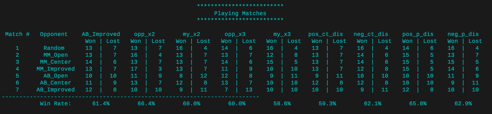

# Build a Game-playing Agent


## Synopsis

This project develops an adversarial search agent to play the game "Isolation".  Isolation is a deterministic, two-player game of perfect information in which the players alternate turns moving a single piece from one cell to another on a board.  Whenever either player occupies a cell, that cell becomes blocked for the remainder of the game.  The first player with no remaining legal moves loses, and the opponent is declared the winner.  These rules are implemented in the `isolation.Board` class provided in the repository.

This project uses a version of Isolation where each agent is restricted to L-shaped movements (like a knight in chess) on a rectangular grid (like a chess or checkerboard).  The agents can move to any open cell on the board that is 2-rows and 1-column or 2-columns and 1-row away from their current position on the board. Movements are blocked at the edges of the board (the board does not wrap around), however, the player can "jump" blocked or occupied spaces (just like a knight in chess).


Additionally, agents will have a fixed time limit each turn to search for the best move and respond.  If the time limit expires during a player's turn, that player forfeits the match, and the opponent wins.

Additional files include example Player and evaluation functions, the game board class, and a template to develop local unit tests.


### Quick Start Guide

The following example creates a game and illustrates the basic API.  You can run this example by executing the command `python sample_players.py`

```
from isolation import Board
from sample_players import RandomPlayer
from sample_players import GreedyPlayer

# create an isolation board (by default 7x7)
player1 = RandomPlayer()
player2 = GreedyPlayer()
game = Board(player1, player2)

# place player 1 on the board at row 2, column 3, then place player 2 on
# the board at row 0, column 5; display the resulting board state.  Note
# that the .apply_move() method changes the calling object in-place.
game.apply_move((2, 3))
game.apply_move((0, 5))
print(game.to_string())

# players take turns moving on the board, so player1 should be next to move
assert(player1 == game.active_player)

# get a list of the legal moves available to the active player
print(game.get_legal_moves())

# get a successor of the current state by making a copy of the board and
# applying a move. Notice that this does NOT change the calling object
# (unlike .apply_move()).
new_game = game.forecast_move((1, 1))
assert(new_game.to_string() != game.to_string())
print("\nOld state:\n{}".format(game.to_string()))
print("\nNew state:\n{}".format(new_game.to_string()))

# play the remainder of the game automatically -- outcome can be "illegal
# move", "timeout", or "forfeit"
winner, history, outcome = game.play()
print("\nWinner: {}\nOutcome: {}".format(winner, outcome))
print(game.to_string())
print("Move history:\n{!s}".format(history))
```

### Tournament

The `tournament.py` script is used to evaluate the effectiveness of custom heuristics.  The script measures relative performance of your agent (named "Student" in the tournament) in a round-robin tournament against several other pre-defined agents. The Custom agent uses time-limited Iterative Deepening along with custom heuristics.

The performance of time-limited iterative deepening search is hardware dependent (faster hardware is expected to search deeper than slower hardware in the same amount of time).  The script controls for these effects by also measuring the baseline performance of an agent called "ID_Improved" that uses Iterative Deepening and the improved_score heuristic defined in `sample_players.py`.

The tournament opponents are listed below.

- Random: An agent that randomly chooses a move each turn.
- MM_Open: MinimaxPlayer agent using the open_move_score heuristic with search depth 3
- MM_Center: MinimaxPlayer agent using the center_score heuristic with search depth 3
- MM_Improved: MinimaxPlayer agent using the improved_score heuristic with search depth 3
- AB_Open: AlphaBetaPlayer using iterative deepening alpha-beta search and the open_move_score heuristic
- AB_Center: AlphaBetaPlayer using iterative deepening alpha-beta search and the center_score heuristic
- AB_Improved: AlphaBetaPlayer using iterative deepening alpha-beta search and the improved_score heuristic


## Game Visualization

The `isoviz` folder contains a modified version of chessboard.js that can animate games played on a 7x7 board.  In order to use the board, you must run a local webserver by running `python -m http.server 8000` from your project directory (you can replace 8000 with another port number if that one is unavailable), then open your browser to `http://localhost:8000` and navigate to the `/isoviz/display.html` page.  Enter the move history of an isolation match (i.e., the array returned by the Board.play() method) into the text area and run the match.  Refresh the page to run a different game.  (Feel free to submit pull requests with improvements to isoviz.)

## Experiments

### Factors of Heuristic Function
At first, I designed several heuristic functions based on `improved_score()` in `sample_players.py`, such as multiplying `my_moves` or `oppnent_moves` by a constant, adding `distance_from_center` or adding `distance_between_players`. But I didn't know which constant I should chose and the signs(positive or negtive) of these factors. So I refactored `tornament.py` in order to compare different signs(positive or negtive) of all these factors.

Here are heuristic functions I designed for testing in `my_tornament.py`:
```
my_moves = len(game.get_legal_moves(player))
opponent_moves = len(game.get_legal_moves(game.get_opponent(player)))
w, h = game.width / 2., game.height / 2.
y_m, x_m = game.get_player_location(player)
y_o, x_o = game.get_player_location(game.get_opponent(player))
center_distant = math.sqrt((h - y_m) ** 2 + (w - x_m) ** 2)
player_distant = math.sqrt((y_m - y_o) ** 2 + (x_m - y_o) ** 2)
```
- opp\_x2() - `opponent_moves` is multiplied by 2
  ```
  score = float(my_moves - 2 * opponent_moves)
  ```
- my\_x2() - `my_moves` is multiplied by 2
  ```
  score = float(2 * my_moves - opponent_moves)
  ```
- opp\_x3() - `opponent_moves` is multiplied by 3
  ```
  score = float(my_moves - 3 * opponent_moves)
  ```
- my\_x3() - `my_moves` is multiplied by 3
  ```
  score = float(3 * my_moves - opponent_moves)
  ```
- pos\_center\_dis() - base score plus distance from the center of game board
  ```
  score = float(my_moves - opponent_moves + center_distant)
  ```
- neg\_center\_dis() - base score minus distance from the center of game board
  ```
  score = float(my_moves - opponent_moves - center_distant)
  ```
- pos\_player\_dis() - base score plus distance between players
  ```
  score = float(my_moves - opponent_moves + player_distant)
  ```
- neg\_player\_dis() - base score minus distance between players
  ```
  score = float(my_moves - opponent_moves - player_distant)
  ```
In order to evaluate these heuristic functions better, I set `NUM_MATCHES` to 10 and `TIME_LIMIT` to 500. Then I got the performance table:

***
### Combination of Factors
Form the performance table above, I decided the sign of each factor:
- Choice: opp\_x2
  > opp\_x2 > opp\_x3 = my\_x2 > my\_x3
- Choice: neg\_center\_dis
  > neg\_center\_dis > pos\_center\_dis
- Choice: pos\_player\_dis
  > pos\_player\_dis > neg\_player\_dis

Then I combined every two of factors as well as all of them to get candidates of the finally heuristic function:
- ox2\_ppd() - opp\_x2() & pos\_player\_dis()
  ```
  score = float(my_moves - opponent_moves * 2 + player_distant)
  ```
- ox2\_ncd() - opp\_x2() & neg\_center\_diss()
  ```
  score = float(my_moves - opponent_moves * 2 - center_distant)
  ```
- ncd\_ppd() - neg\_center\_diss() & pos\_player\_dis()
  ```
  score = float(my_moves - opponent_moves - center_distant + player_distant)
  ```
- ox2\_ncd\_ppd() - opp\_x2() & neg\_center\_diss() & pos\_player\_dis()
  ```
  score = float(my_moves - opponent_moves * 2 - center_distant + player_distant)
  ```

Performance Table:

***
### Final Heuristic Function
Form the performance table of conbination factors above, I decided the oder of final heuristic functions:
- custom\_score():
- custom\_score\_2():
- custom\_score\_3():